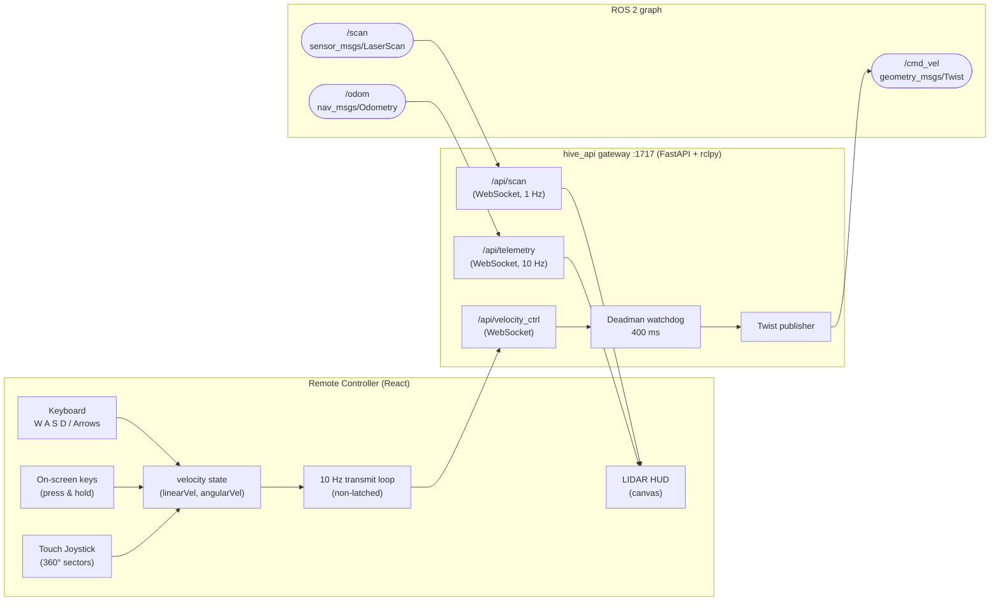
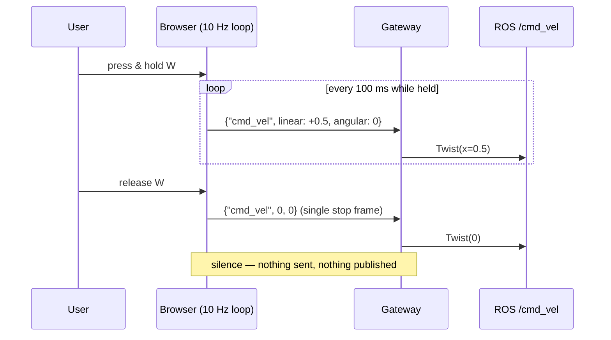
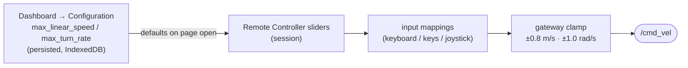

# 🎮 Remote Controller — Design & Strategy Document

> Teleoperation app of the Robot App Store: live LIDAR situational awareness plus
> keyboard / on-screen-key / joystick driving over a safety-guarded WebSocket →
> ROS 2 `/cmd_vel` pipeline.

**Files:** [`src/pages/RemoteControllerPage.tsx`](../src/pages/RemoteControllerPage.tsx) ·
[`src/hooks/useVelocityCtrl.ts`](../src/hooks/useVelocityCtrl.ts) ·
[`src/hooks/useScan.ts`](../src/hooks/useScan.ts) ·
[`backend/hive_api_gateway/hive_api_gateway/main.py`](../backend/hive_api_gateway/hive_api_gateway/main.py)

---

## 1. Architecture



One page, three independent WebSocket channels — each with its own auto-reconnect
(exponential backoff 2 s → 10 s):

| Channel | Direction | Rate | Purpose |
|---|---|---|---|
| `/api/velocity_ctrl` | browser → robot | 10 Hz while driving | Teleop commands → `/cmd_vel` |
| `/api/scan` | robot → browser | 1 Hz | Live LaserScan for the HUD dial |
| `/api/telemetry` | robot → browser | 10 Hz | Odometry X / Y / θ readout |

---

## 2. Teleop Transmission Strategy — *non-latched, stream-while-active*

The core contract, chosen so the robot **never keeps moving on stale input**:

```
        input active                       input released
      ┌───────────────┐                  ┌───────────────┐
IDLE ─┤ stream frames ├─── release ────▶ │ ONE zero frame│──▶ QUIET
      │   @ 10 Hz     │                  │  then silence │
      └───────────────┘                  └───────────────┘
            ▲                                                │
            └────────────── user drives again ◀──────────────┘
```

1. **While any input is active** (velocity ≠ 0): the browser streams
   `{"type": "cmd_vel", "linear": <m/s>, "angular": <rad/s>}` at 10 Hz.
2. **On release**: exactly **one** all-zero frame is sent, then the channel goes
   quiet. Nothing is latched — the gateway publishes exactly one `Twist` per
   frame received, never repeats, never remembers.
3. **While idle**: zero network traffic, zero `/cmd_vel` publications. Nav2 and
   other `/cmd_vel` publishers are never fought against.



### Why not latched?

A latched/held command means a dropped WebSocket, crashed tab, or frozen browser
leaves the robot driving at its last speed indefinitely. The stream-while-active
model makes *presence of traffic* the proof of operator intent.

---

## 3. Safety Layers (defense in depth)

| # | Layer | Where | Behavior |
|---|---|---|---|
| 1 | **Command clamp** | gateway | `linear` clamped to ±0.8 m/s, `angular` to ±1.0 rad/s regardless of what any client sends |
| 2 | **Deadman watchdog** | gateway | If the last published command was non-zero and **no frame arrives within 400 ms** → publish one zero `Twist`. Covers browser crash, tab close, Wi-Fi drop |
| 3 | **Disconnect stop** | gateway | Socket closes while the robot is moving → final zero `Twist` in the `finally` block |
| 4 | **Release stop ×2** | browser | Joystick release / key-up sends an immediate zero AND the 10 Hz loop sends its own transition zero |
| 5 | **E-STOP button** | browser | Immediate zero frame + local velocity reset |
| 6 | **UI slider bounds** | browser + dashboard | Limits configurable only within 0.1–0.8 m/s and 0.1–1.0 rad/s |

**Verified:** a test client streamed 10 non-zero frames and died without a stop
frame — the robot received the 10 commands plus exactly one watchdog zero ~400 ms
later. An over-limit request of 99 m/s arrived on `/cmd_vel` as 0.8 m/s.

---

## 4. Input Mapping

All commands follow ROS conventions (**REP 103**): `linear.x` forward-positive,
`angular.z` yaw **CCW-positive** (left turn = `+`).

### 4.1 Keyboard & on-screen keys

Physical keys and the clickable on-screen tiles share one code path
(`setKeyState` → `updateVelocityFromKeys`), so behavior is pixel-identical.

| Key | `linear.x` | `angular.z` | Meaning |
|---|---|---|---|
| **W** / ↑ | `+MAX_LINEAR_SPEED` | — | forward |
| **S** / ↓ | `−MAX_LINEAR_SPEED` | — | reverse |
| **A** / ← | — | `+MAX_TURN_RATE` | turn left (CCW) |
| **D** / → | — | `−MAX_TURN_RATE` | turn right (CW) |
| **W+A** | `+MAX` | `+MAX` | forward-left arc |
| **W+D** | `+MAX` | `−MAX` | forward-right arc |

On-screen tiles are press-and-hold: `mousedown`/`touchstart` drives,
`mouseup`/`touchend`/`mouseleave` stops (no stuck keys when dragging off a tile).

### 4.2 Touch Joystick — 360° sector map

Stick angle uses math convention: **0° = right, 90° = front (up), 180° = left,
270° = back**. Cardinal sectors are ±10°; the four diagonals fill the gaps and
blend at half rate. A **25 % deadzone** suppresses jitter around center.

```
                        FRONT  90°±10°
                     (+MAX lin, 0 ang)
                  ┌────────────────────┐
      FRONT-LEFT  │        ▲▲▲         │  FRONT-RIGHT
     100° – 170°  │      ▲▲▲▲▲▲        │  10° – 80°
   (+½lin, +½ang) │    ▲▲▲▲▲▲▲▲▲       │  (+½lin, −½ang)
                  │                    │
   LEFT 180°±10°  │◀◀◀    ● 25%    ▶▶▶│  RIGHT 0°±10°
   (0, +MAX ang)  │      deadzone      │  (0, −MAX ang)
                  │                    │
      BACK-LEFT   │      ▼▼▼▼▼▼        │  BACK-RIGHT
     190° – 260°  │        ▼▼▼         │  280° – 350°
   (−½lin, −½ang) └────────────────────┘  (−½lin, +½ang)
                        BACK  270°±10°
                     (−MAX lin, 0 ang)
```

| Sector | Angle range | `linear.x` | `angular.z` |
|---|---|---|---|
| FRONT | 80° – 100° | `+MAX` | 0 |
| FRONT-RIGHT | 10° – 80° | `+0.5·MAX` | `−0.5·MAX` |
| RIGHT | 350° – 10° | 0 | `−MAX` (rotate in place) |
| BACK-RIGHT | 280° – 350° | `−0.5·MAX` | `+0.5·MAX` |
| BACK | 260° – 280° | `−MAX` | 0 (straight reverse) |
| BACK-LEFT | 190° – 260° | `−0.5·MAX` | `−0.5·MAX` |
| LEFT | 170° – 190° | 0 | `+MAX` (rotate in place) |
| FRONT-LEFT | 100° – 170° | `+0.5·MAX` | `+0.5·MAX` |
| deadzone | stick < 25 % travel | 0 | 0 |

> The reverse diagonals are **mirrored** (same convention as
> `teleop_twist_keyboard`): pushing the stick toward back-left makes the robot
> move backward-left *on screen*, which feels natural — like reversing a car.

---

## 5. Drive Limits & Configuration

Two user-tunable limits feed every mapping above:

| Parameter | Range | Default | Where set |
|---|---|---|---|
| `MAX_LINEAR_SPEED` | 0.1 – 0.8 m/s | 0.5 | Remote Controller sliders **or** Dashboard → Configuration |
| `MAX_TURN_RATE` | 0.1 – 1.0 rad/s | 1.0 | Remote Controller sliders **or** Dashboard → Configuration |

- Dashboard values (`max_linear_speed`, `max_turn_rate` on the robot record,
  IndexedDB) are **persistent** and validated against the same ranges.
- The Remote Controller loads them as its slider defaults on page open;
  slider changes are session-local.
- The gateway clamp (§3, layer 1) uses the same ceilings, so the limits hold
  even against a hand-crafted WebSocket client.



---

## 6. LIDAR Navigation HUD

The radar dial renders the **real** `/scan` LaserScan (via `/api/scan`, the same
stream as the Route Planner's Scan Observation panel) — not an emulation.

**Coordinate convention** — robot at center, robot-forward = screen-up. ROS scan
angles are CCW-positive with 0 = forward, so each beam `i`:

```
angle  a  = angle_min + i · angle_increment
radius r  = ranges[i] · pixels_per_metre          (null / < range_min skipped)

screen_x  = cx − sin(a) · r
screen_y  = cy − cos(a) · r
```

- `pixels_per_metre` fits `min(range_max, 5 m)` inside the dial; range rings are
  drawn at every metre with labels.
- Beams near the cosmetic sweep line glow brighter (radar feel, zero data effect).
- Status chips show live stats: valid-beam count (`324/360 BEAMS`) and sensor
  range (`RANGE: 3.5m`).
- The **LIDAR LIVE / BRIDGE OFFLINE** pill is bound to actual scan data flow
  (`scanConnected && scan !== null`), not merely to a socket being open.

---

## 7. Gateway Endpoint Reference

### `WS /api/velocity_ctrl`

**Client → server** (only message type processed):

```json
{ "type": "cmd_vel", "linear": 0.5, "angular": -0.25 }
```

**Server behavior per frame:** clamp → publish one `geometry_msgs/Twist` on
`/cmd_vel` with `linear.x` and `angular.z` set (all other axes 0 for a
differential-drive ground robot).

**Watchdog:** the receive loop uses a 400 ms timeout; on timeout with a non-zero
last command, one zero `Twist` is published and the flag cleared. On disconnect,
same guarantee via `finally`.

Equivalent manual test:

```bash
# what the endpoint publishes, observable with:
ros2 topic echo /cmd_vel

# manual equivalent of one frame:
ros2 topic pub --once /cmd_vel geometry_msgs/msg/Twist \
  "{linear: {x: 0.5, y: 0.0, z: 0.0}, angular: {x: 0.0, y: 0.0, z: 0.0}}"
```

---

## 8. Design Decisions Summary

| Decision | Choice | Rationale |
|---|---|---|
| Command transport | WebSocket, JSON frames | Low latency, bidirectional-capable, matches the app's other live channels |
| Latching | **None** — 1 frame = 1 publish | Stale-command runaway is impossible by construction |
| Cadence | 10 Hz while active, silent when idle | Smooth control; no interference with Nav2 when not teleoperating |
| Stop signalling | Client zero + server deadman + disconnect stop | No single point of failure for "robot must stop" |
| Sign conventions | REP 103 everywhere | Zero translation bugs between UI, gateway, and robot |
| Joystick model | Discrete sectors, not proportional | Predictable, spec-exact speeds; diagonals at half rate |
| Limit storage | Robot record in IndexedDB via Dashboard | Same pattern as all other robot configuration fields |
| HUD data | Real `/scan`, 1 Hz, nulls filtered | Truthful situational awareness; nulls = invalid beams |

---

*Robot App Store · Remote Controller strategy document · lives beside the code it
describes — update it when the teleop contract changes.*
