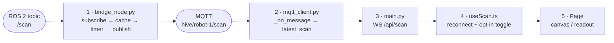

# 🛰️ Robot Sensors App — Build Guide

> How the Remote Controller was built, generalised into a repeatable recipe,
> then applied to a new Sensors app that shows **real hardware** instead of the
> hardcoded list the Dashboard shows today.

**Reference implementation:** [`src/pages/RemoteControllerPage.tsx`](../src/pages/RemoteControllerPage.tsx) ·
[`docs/RemoteController.md`](RemoteController.md)

---

## Part 0 — Start here: what exists today is fake

Before designing anything, know the starting point. The Dashboard already has a
Sensors tab listing six sensors. **All six are hardcoded** in
[`src/lib/localDb.ts`](../src/lib/localDb.ts):

```ts
// getSensors() — seeded once into IndexedDB, never touches the robot
{ name: 'LiDAR RPLidar-A2',  status: 'active',  frequency: '20Hz',  temperature: 34 },
{ name: 'IMU BNO085',        status: 'active',  frequency: '100Hz', temperature: 28 },
{ name: 'Camera Front …',    status: 'active',  frequency: '30fps', temperature: 42 },
…
```

Those temperatures, rates and statuses are invented. Only two cards show
anything real, and only because `DashboardPage` string-matches the name and
splices in live data:

```tsx
/lidar/i.test(s.name)   && scan       ? `${validBeams} beams · max ${range_max} m`
/encoder/i.test(s.name) && robotState ? `odom ${x}, ${y} m`
```

**What the robot actually publishes through the bridge today — the complete list:**

| ROS topic | Message type | Reaches the browser as |
|---|---|---|
| `/scan` | `sensor_msgs/LaserScan` | `WS /api/scan` (opt-in) |
| `/odom` | `nav_msgs/Odometry` | `WS /api/telemetry` |
| `/camera/image_raw` | `sensor_msgs/Image` | WebRTC via `POST /webrtc/offer` |
| `/amcl_pose` | `PoseWithCovarianceStamped` | `WS /api/localisation` |
| `/plan` | `nav_msgs/Path` | `WS /api/plan` |
| `/cmd_vel` | `geometry_msgs/Twist` | liveness only |

**There is no IMU, no battery, no joint states.** Nothing subscribes to them.
The single biggest piece of backend work in this project is adding them — see
Part 3.

So the Sensors app is not a UI job. It is: *make the backend expose real sensor
data, then build a UI that cannot show a value the hardware didn't produce.*

---

## Part 1 — The recipe (how Remote Controller was actually built)

Every live feature in this system crosses the same five layers. Adding a sensor
means writing one piece at each. This is the whole pattern.



### Layer 1 — Bridge: ROS → MQTT

[`backend/hive_mqtt_bridge/hive_mqtt_bridge/bridge_node.py`](../backend/hive_mqtt_bridge/hive_mqtt_bridge/bridge_node.py)

Three parts, always in this shape:

```python
# (a) subscribe, cache the latest message only — never queue
_be_qos = QoSProfile(depth=5, reliability=QoSReliabilityPolicy.BEST_EFFORT)
self.create_subscription(LaserScan, "/scan", self._scan_cb, _be_qos)

def _scan_cb(self, msg):
    with self._scan_data_lock:            # rclpy thread writes, timer reads
        self._latest_scan_msg = msg
        self._scan_received = True
    with self._alive_lock:
        self._scan_time = time.monotonic()   # feeds /health

# (b) shape it into a JSON-safe dict — NaN/inf become null, floats get rounded
def get_scan(self):
    ...
    ranges = [round(r, 3) if math.isfinite(r) else None for r in msg.ranges]
    return {"frame_id": ..., "angle_min": ..., "ranges": ranges}

# (c) publish on a timer, not on every callback
self.create_timer(1.0, self._scan_tick)     # 1 Hz, not the sensor's 20 Hz
```

**Non-obvious and load-bearing:**

- **Timer, not callback-driven publish.** A 20 Hz LIDAR would flood the broker.
  The timer decouples sensor rate from wire rate.
- **`math.isfinite` → `null`.** ROS uses `inf` for out-of-range beams. JSON has
  no `inf`; `json.dumps` emits bare `Infinity`, which `JSON.parse` rejects.
  Every consumer then breaks with no useful error.
- **Round aggressively.** `round(r, 3)` is millimetre precision and roughly
  halves the payload.
- **Stamp a liveness timestamp** so `/health` can report the sensor.

### Layer 2 — Gateway cache: MQTT → memory

[`backend/hive_api_gateway/app/mqtt_client.py`](../backend/hive_api_gateway/app/mqtt_client.py)

```python
elif suffix == 'scan':
    self.latest_scan = data          # latest-value-wins, no lock needed
```

Single-threaded asyncio — every handler and the MQTT loop share one event loop,
so plain attribute assignment is safe. (The old rclpy-in-process gateway needed
locks everywhere; this one does not.)

### Layer 3 — Gateway endpoint: memory → WebSocket

[`backend/hive_api_gateway/app/main.py`](../backend/hive_api_gateway/app/main.py)

```python
@api_app.websocket("/api/scan")
async def scan_ws(ws: WebSocket):
    await ws.accept()
    enabled = False                                   # opt-in, off by default
    while True:
        try:
            raw = await asyncio.wait_for(ws.receive_text(), timeout=1.0)
            if json.loads(raw).get("type") == "scan_toggle":
                enabled = bool(json.loads(raw).get("enabled"))
        except asyncio.TimeoutError:
            pass                                      # timeout IS the tick
        if enabled and mqtt_client.latest_scan:
            await ws.send_json(mqtt_client.latest_scan)
```

**The `wait_for` timeout doubles as the send interval.** One loop both receives
control messages and paces sends — no second task, no queue.

### Layer 4 — React hook: WebSocket → state

[`src/hooks/useScan.ts`](../src/hooks/useScan.ts)

Every hook in `src/hooks/` is the same 60 lines:

```ts
const ws = new WebSocket(toWsUrl(GATEWAY_URL, '/api/scan'));

ws.onopen    = () => { setConnected(true); reconnectDelay.current = 2000;
                       sendToggle(ws, liveEnabledRef.current); }   // re-assert on reconnect
ws.onmessage = (e) => { try { setScan(JSON.parse(e.data)) } catch { /* ignore */ } }
ws.onclose   = () => { setConnected(false); setScan(null);          // drop stale data
                       setTimeout(connect, delay); delay = Math.min(delay*1.5, 10000) }

return () => { ws.onclose = null; ws.close() }    // null FIRST — else unmount reconnects
```

Four details that are all bug fixes:

1. **`ws.onclose = null` before `close()`** — otherwise unmounting schedules a
   reconnect to a dead component.
2. **`setScan(null)` on close** — a stale LIDAR frame frozen on screen is worse
   than an empty dial. The UI must be able to tell "no data" from "old data".
3. **Re-send the toggle in `onopen`** — the server forgets on reconnect.
4. **`liveEnabledRef`** — the closure captures the value at mount; the ref keeps
   `onopen` reading the current one.

### Layer 5 — Page: state → pixels

The LIDAR HUD ([`RemoteControllerPage.tsx:385`](../src/pages/RemoteControllerPage.tsx#L385))
is the visualization template:

```ts
const s = scanRef.current;                  // ref, not state — rAF must not re-render
const ppm = maxR / Math.min(s.range_max, 5.0);
const a  = s.angle_min + i * s.angle_increment;
const ox = cx - Math.sin(a) * r * ppm;      // ROS CCW-positive, forward = screen-up
const oy = cy - Math.cos(a) * r * ppm;
```

- **`requestAnimationFrame` reads a ref, never state.** State would re-render at
  60 fps.
- **Data drives the status pill, not the socket:** `scanConnected && scan !== null`.
  An open socket carrying nothing must read as OFFLINE.

---

## Part 2 — Conventions worth copying verbatim

| Convention | Why it exists |
|---|---|
| **Expensive streams are opt-in** | LIDAR is an O(n) pass over every beam; camera encoding costs real CPU on the robot. `useScan(false)` / `useCameraStream(false)` until the operator asks. |
| **Latest-value-wins everywhere** | A queue adds latency to a live feed and can never catch up. Every cache holds exactly one message. |
| **Reconnect 2 s → ×1.5 → 10 s cap** | Identical in every hook and in the gateway's own broker client, so the whole system degrades the same way. |
| **Nothing latches** | One frame in = one action out. Applies to teleop; apply it to any sensor-triggered action too. |
| **REP 103 end to end** | `x` forward, CCW-positive yaw, metres, radians. Convert at the display edge only. |
| **`age_s` on every payload** | The bridge stamps how old the reading is. Without it the UI cannot distinguish live from frozen. |

---

## Part 3 — The Sensors app

### 3.1 What to build, in order

**Step 1 — Add the missing sensors to the bridge.** This is the real work. IMU
is the highest value: it's genuinely absent, TurtleBot3 publishes it, and it
visualises beautifully.

In `bridge_node.py`, following the `/scan` template exactly:

```python
from sensor_msgs.msg import Imu, BatteryState
from sensor_msgs.msg import JointState

self.create_subscription(Imu, "/imu", self._imu_cb, _be_qos)
self.create_subscription(BatteryState, "/battery_state", self._battery_cb, _be_qos)
self.create_subscription(JointState, "/joint_states", self._joint_cb, _be_qos)

def get_imu(self):
    with self._imu_lock:
        if not self._imu_received:
            return None
        msg = self._latest_imu
    q = msg.orientation
    return {
        "type": "imu",
        "frame_id": msg.header.frame_id,
        "orientation":     {"x": round(q.x, 5), "y": round(q.y, 5),
                            "z": round(q.z, 5), "w": round(q.w, 5)},
        # Derived here so the UI doesn't reimplement quaternion maths:
        "roll_deg":  round(math.degrees(math.atan2(
            2*(q.w*q.x + q.y*q.z), 1 - 2*(q.x*q.x + q.y*q.y))), 2),
        "pitch_deg": round(math.degrees(math.asin(
            max(-1.0, min(1.0, 2*(q.w*q.y - q.z*q.x))))), 2),
        "yaw_deg":   round(math.degrees(math.atan2(
            2*(q.w*q.z + q.x*q.y), 1 - 2*(q.y*q.y + q.z*q.z))), 2),
        "angular_velocity":    {"x": ..., "y": ..., "z": ...},   # rad/s
        "linear_acceleration": {"x": ..., "y": ..., "z": ...},   # m/s²
        "age_s": round(time.monotonic() - self._imu_time, 2),
    }

self.create_timer(0.1, self._imu_tick)      # 10 Hz — enough for a live attitude dial
```

Confirm the topics exist before writing the subscriber:

```bash
docker exec robotstore_cont-run-arm bash -lc \
  'source /opt/ros/humble/setup.bash && ros2 topic list && ros2 topic hz /imu'
```

**Step 2 — One multiplexed endpoint, not one per sensor.**

The Remote Controller opens three sockets. A sensors page with eight sensors
should not open eight. Extend the `scan_toggle` idea into a subscription model:

```python
@api_app.websocket("/api/sensors")
async def sensors_ws(ws: WebSocket):
    """
    Client -> server:  {"type": "subscribe",   "sensors": ["imu", "scan"]}
                       {"type": "unsubscribe", "sensors": ["scan"]}
    Server -> client:  {"type": "sensor_frame", "sensor": "imu", "data": {...}}

    One socket, N sensors, per-sensor opt-in — so an idle card costs nothing
    and expanding one card starts exactly one stream.
    """
    await ws.accept()
    subscribed: set[str] = set()
    SOURCES = {
        "scan":      lambda: mqtt_client.latest_scan,
        "imu":       lambda: mqtt_client.latest_imu,
        "odom":      lambda: mqtt_client.latest_telemetry,
        "battery":   lambda: mqtt_client.latest_battery,
        "joints":    lambda: mqtt_client.latest_joints,
    }
    while True:
        try:
            msg = json.loads(await asyncio.wait_for(ws.receive_text(), timeout=0.2))
            if msg.get("type") == "subscribe":
                subscribed |= set(msg.get("sensors", [])) & SOURCES.keys()
            elif msg.get("type") == "unsubscribe":
                subscribed -= set(msg.get("sensors", []))
        except asyncio.TimeoutError:
            pass
        for name in subscribed:
            data = SOURCES[name]()
            if data:
                await ws.send_json({"type": "sensor_frame", "sensor": name, "data": data})
```

Add a discovery endpoint so the UI never hardcodes the list:

```python
@api_app.get("/api/sensors")
async def list_sensors():
    """Every sensor the robot actually has, with liveness — this REPLACES the
    hardcoded array in localDb.ts."""
    return {"sensors": [
        {"id": "scan", "name": "LIDAR", "topic": "/scan",
         "msg_type": "sensor_msgs/LaserScan", "viz": "polar",
         "online": mqtt_client.latest_scan is not None},
        {"id": "imu", "name": "IMU", "topic": "/imu",
         "msg_type": "sensor_msgs/Imu", "viz": "attitude",
         "online": mqtt_client.latest_imu is not None},
        ...
    ]}
```

**Step 3 — `useSensors.ts`**, copied from `useScan.ts` with the toggle replaced
by a subscription set:

```ts
export function useSensors(subscribed: string[]) {
  const [frames, setFrames] = useState<Record<string, SensorFrame>>({});
  // ... identical reconnect/backoff block from useScan ...
  ws.onmessage = (e) => {
    const m = JSON.parse(e.data);
    if (m.type === 'sensor_frame')
      setFrames(prev => ({ ...prev, [m.sensor]: m.data }));   // keyed by sensor
  };
  // re-send the full subscription set in onopen — the server forgets on reconnect
}
```

**Step 4 — Delete the fake data.** Replace `localDb.getSensors()` with a fetch
of `GET /api/sensors`. Keep IndexedDB only for user-authored notes/nicknames.
A sensor the robot doesn't have must not be listable.

### 3.2 Visualization per sensor

| Sensor | Visualization | Reuse |
|---|---|---|
| **LIDAR** | Polar dial, range rings, beam count | Lift the HUD from `RemoteControllerPage.tsx:385` into `src/components/sensors/LidarDial.tsx` |
| **IMU** | Attitude indicator (artificial horizon) + rolling accel/gyro traces | New — `roll_deg`/`pitch_deg` already computed server-side |
| **Camera** | `<video>` + WebRTC | `useCameraStream` unchanged |
| **Odometry / encoders** | XY breadcrumb trail + speed gauge | `useTelemetry` |
| **Battery** | Gauge + voltage sparkline | New |
| **Joint states** | Per-wheel RPM bars | New |

Extract the shared card shell once — every sensor card has the same anatomy:

```tsx
<SensorCard
  name="IMU" topic="/imu" msgType="sensor_msgs/Imu"
  online={!!frames.imu} rateHz={measuredRate.imu}
  onExpand={() => subscribe('imu')}      // streaming starts only when opened
>
  <AttitudeIndicator roll={frames.imu?.roll_deg} pitch={frames.imu?.pitch_deg} />
</SensorCard>
```

### 3.3 What makes it a *learning* tool

This is where it stops being a dashboard. Each of these is small and turns a
number into an explanation:

1. **Show the plumbing.** Print the ROS topic and message type on every card
   (`/imu · sensor_msgs/Imu · 10 Hz`). The learner sees the actual name they'd
   type into `ros2 topic echo`.
2. **Raw frame inspector.** A "Raw" toggle showing the exact JSON alongside the
   visual — connects "spinning horizon" to `orientation.w = 0.9998`.
3. **Copy-the-CLI.** A button emitting the equivalent command:
   `ros2 topic echo /imu --once`. Runs it in their own terminal, proves the app
   isn't faking it. (The Remote Controller doc already does this for `/cmd_vel`.)
4. **Measured rate, not claimed rate.** Count frames client-side and display the
   real Hz. The current fake list claims "100Hz" for an IMU that publishes
   nothing — a measured `0.0 Hz · OFFLINE` teaches more than an invented number.
5. **Freeze frame.** Pause one sensor and step through the last N readings.
   Impossible with `ros2 topic echo`, and it's how you actually see what a
   LIDAR beam does at a doorway.
6. **Provoke the sensor.** "Drive forward 0.2 m/s for 2 s" next to the IMU card,
   so the learner *causes* the accelerometer spike they're watching. Reuse
   `useVelocityCtrl` — and inherit every safety layer in
   [`docs/RemoteController.md §3`](RemoteController.md).
7. **Unit surfacing.** Label `rad/s` vs `deg/s`, `m` vs `px`, and show the
   conversion. Most robotics confusion is unit confusion.

### 3.4 Safety — item 6 needs the full teleop contract

The moment the page can command motion it inherits the Remote Controller's
obligations, not a subset:

- Stream at 10 Hz while active, one zero frame on release, then silence
- Never latch — one frame in, one `Twist` out
- The gateway clamp (±0.8 m/s, ±1.0 rad/s) and both deadmen (400 ms gateway,
  500 ms bridge) already apply, since it's the same endpoint
- An E-STOP visible without scrolling, on every screen that can move the robot

If the Sensors app is read-only, none of this applies — which is a good reason
to ship v1 read-only and add provocation in v2.

---

## Part 4 — Testing it

The suites in [`docs/TESTING.md`](TESTING.md) extend directly:

| Layer | Add to | Test |
|---|---|---|
| Bridge payload shaping | `backend/hive_mqtt_bridge/test/` | `get_imu()` returns `null` before the first message; `inf`/`NaN` never survive into JSON; quaternion → Euler against known values |
| Gateway cache + endpoint | `tests/integration/` | subscribe/unsubscribe gating; unknown sensor id ignored; nothing sent before subscribing |
| Hook | `src/hooks/__tests__/` | reconnect re-sends the subscription set; frames keyed per sensor; stale frame cleared on close |
| Live | `tests/system/` | `/api/sensors` lists only sensors that are actually publishing |

The one that matters most, because it is the whole premise of the app:

```python
def test_a_sensor_that_is_not_publishing_is_reported_offline(http):
    """The app's core promise: it cannot show a value the hardware didn't
    produce. The old hardcoded list claimed a 100Hz IMU on a robot with no
    IMU topic at all."""
    for sensor in http.get("/api/sensors").json()["sensors"]:
        if not sensor["online"]:
            assert sensor.get("last_value") is None
```

---

## Part 5 — Suggested order

1. `ros2 topic list` on the real robot — build against what exists, not the spec sheet
2. Bridge: add `/imu` (+ battery, joints if present), publish at 10 Hz
3. Gateway: `latest_imu` cache → `GET /api/sensors` → `WS /api/sensors`
4. `useSensors.ts` (copy `useScan.ts`, swap toggle for subscription set)
5. Extract `LidarDial` out of `RemoteControllerPage` into `components/sensors/`
6. `SensorsPage` — grid of cards, expand to stream
7. Delete the hardcoded array from `localDb.ts`
8. Add the learning affordances (§3.3) — this is the differentiator, not an extra
9. Tests at each layer as you go

---

*Robot App Store · Sensors app build guide · pattern extracted from the Remote
Controller — keep both in sync when the live-data contract changes.*
