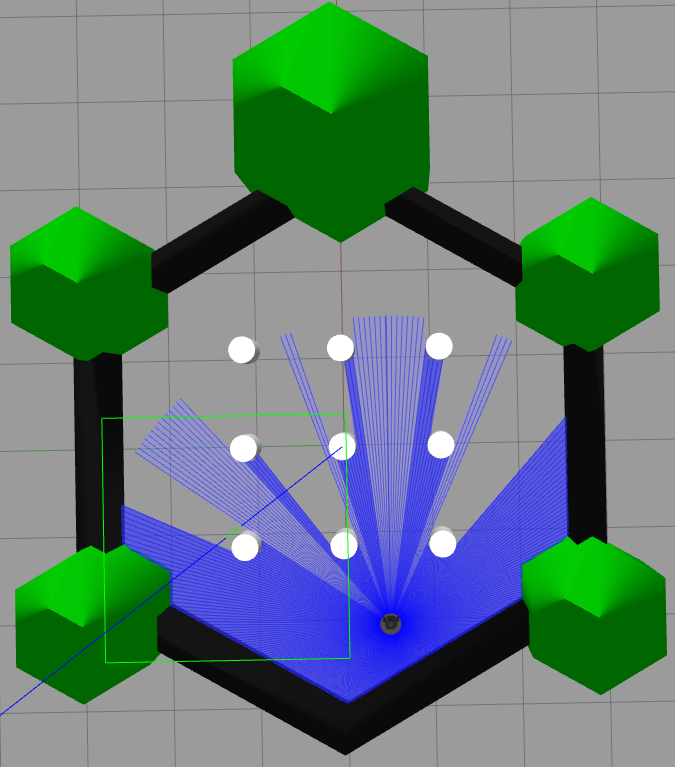
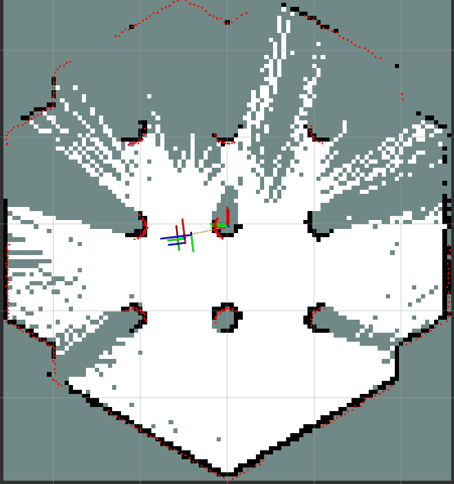
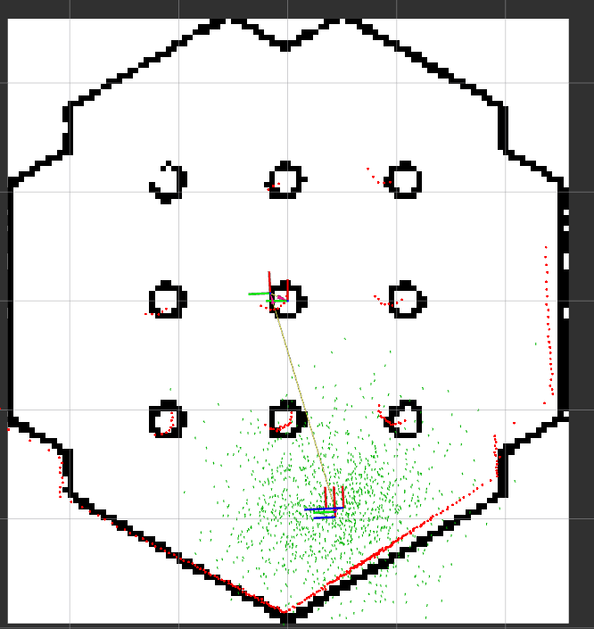
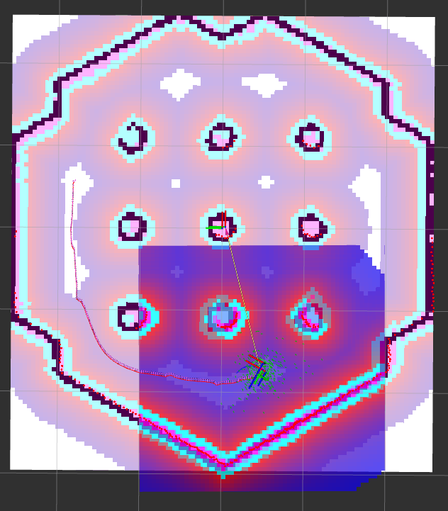

# 🐢 TurtleBot3 Autonomous Navigation & Simulation (ROS 2 Humble)

This repository provides a complete simulation environment for the **TurtleBot3 Burger**, pre-configured for **SLAM (Simultaneous Localization and Mapping)**, **AMCL Localization**, and **Autonomous Navigation (Nav2)**.

It includes a suite of automated **Bash Scripts** located in `src/bash_scripts/` to abstract complex launch sequences, making it ideal for robotics students and researchers focusing on algorithm testing rather than boilerplate configuration.

---

## 📋 Prerequisites

* **OS:** Ubuntu 22.04 LTS (Jammy Jellyfish)
* **ROS Distribution:** ROS 2 Humble Hawksbill
* **Simulator:** Gazebo Classic 11

### 📦 System Dependencies

Before using this repository, ensure the required ROS 2 packages are installed:

```bash
sudo apt update
sudo apt install -y \
    ros-humble-gazebo-ros-pkgs \
    ros-humble-navigation2 \
    ros-humble-nav2-bringup \
    ros-humble-slam-toolbox \
    ros-humble-turtlebot3* \
    ros-humble-teleop-tools  # Required for 'key_teleop' (Dead-man switch)
```

`rosdep install` (step 3 below) pulls in the RPLIDAR driver's own dependencies
(`rclcpp`, `sensor_msgs`, `std_srvs`, `rclcpp_components`) automatically since
its source is vendored in this repo — see the "RPLIDAR (LiDAR Driver)"
section below.

---

## 🛠️ Installation & Setup

We recommend creating a fresh workspace for this simulation.

### 1. Create Workspace

```bash
mkdir -p ~/turtlebot_ws/src
cd ~/turtlebot_ws/src
```

### 2. Clone Repository

Clone this repository into the src folder.

```bash
git clone https://github.com/darshan-kt/turtlebot_mcp_ros2.git
```

### 3. Build the Workspace

Return to the workspace root, install dependencies using rosdep, and build.

```bash
cd ~/turtlebot_ws

# Install dependencies defined in package.xml files
rosdep install --from-paths src --ignore-src -r -y

# Build packages
colcon build --symlink-install

# Source the environment
source install/setup.bash
```

### 4. Make Scripts Executable

Ensure the helper scripts have execution permissions:

```bash
chmod +x src/turtlebot_mcp_ros2/bash_scripts/*.sh
```

### 5. Add gazebo setup file into .bashrc

```bash
nano ~/.bashrc

## At the bottom of this file add below line

source /usr/share/gazebo/setup.bash
```

### 6. source .bashrc on terminal or skip this step by opening new terminal
```bash
source ~/.bashrc
```

---

## 🚀 Tutorial 1: SLAM (Mapping the World)

**Objective:** Create a 2D occupancy grid map of an unknown environment.

**Theory:** We use SLAM Toolbox (Simultaneous Localization and Mapping). As the robot moves, it uses LiDAR data to calculate its own position while simultaneously building a map of walls and obstacles.

### Steps:

#### Launch Simulation & Mapper

Run the automated mapping script. This launches Gazebo, SLAM Toolbox, and RViz (pre-configured).

```bash
./src/turtlebot_mcp_ros2/bash_scripts/mapping.sh
```

> **Gazebo World View:** The simulation environment will appear.



#### Drive the Robot

Open a new terminal, source the workspace, and run the teleop script.

```bash
./src/turtlebot_mcp_ros2/bash_scripts/teleop.sh
```

**Controls:** Use Arrow Keys to move.

> **Note:** This uses a "Dead Man's Switch". The robot stops immediately when keys are released.

#### Visualize

Watch the RViz window. You will see:
- **White areas** (free space)
- **Black lines** (walls)
- **Gray areas** (unknown)

Drive until the map is complete.

> **Mapping Process in RViz:** Watch the map build in real-time.



#### Save the Map

Once satisfied, open a new terminal and save the map to the workspace root:

```bash
# Usage: ./src/turtlebot_mcp_ros2/bash_scripts/save_map.sh [map_name]
./src/turtlebot_mcp_ros2/bash_scripts/save_map.sh my_lab_map
```

**Output:** This creates `my_lab_map.yaml` and `my_lab_map.pgm` in your workspace root.

---

## 🔍 Tutorial 2: AMCL (Localization Only)

**Objective:** Localize the robot within a known static map.

**Theory:** AMCL (Adaptive Monte Carlo Localization) uses a particle filter. It spawns thousands of "particles" (hypothetical robot poses). As the robot senses the environment, particles that don't match the sensor readings are discarded, eventually converging on the robot's true position.

### Steps:

#### Launch AMCL

This starts Gazebo, loads the map server, starts the AMCL node, and opens RViz.

```bash
# Usage: ./src/turtlebot_mcp_ros2/bash_scripts/amcl.sh [map_name.yaml]
./src/turtlebot_mcp_ros2/bash_scripts/amcl.sh $(pwd)/src/my_lab_map.yaml
```

#### Initialize Pose (Critical Step)

In the RViz window, the robot might appear in the wrong location.

1. Click the **"2D Pose Estimate"** button (top toolbar)
2. Click and drag on the map where the robot actually is in Gazebo

**Result:** You will see the particle cloud (green arrows) disperse and then converge as you verify the position.

> **AMCL Particle Cloud:** Green arrows representing possible robot positions.



#### Verify

Use `teleop.sh` to spin the robot. The particles should tighten around the robot, confirming it knows where it is.

---

## 🧭 Tutorial 3: Autonomous Navigation

**Objective:** Send the robot to a goal destination while avoiding obstacles autonomously.

**Theory:** The Nav2 Stack performs path planning:
- **Global Planner:** Finds the shortest path from A to B (Dijkstra/A*)
- **Local Planner:** Controls velocity to follow the path while avoiding dynamic obstacles (Costmaps)

### Steps:

#### Launch Navigation

This script brings up the full navigation stack (Map Server + AMCL + Planner + Controller).

```bash
./src/turtlebot_mcp_ros2/bash_scripts/navigation.sh $(pwd)/src/my_lab_map.yaml
```

#### Initialize Pose

Just like in AMCL, use **"2D Pose Estimate"** to tell the robot where it starts.

#### Send a Goal

1. Click the **"2D Goal Pose"** button in RViz
2. Click and drag on a target location on the map

**Result:** The robot will plan a path (green line) and automatically drive to the destination, avoiding obstacles.

> **Nav2 Path Planning:** Green path showing planned route.



---

## 📡 RPLIDAR (LiDAR Driver)

**Objective:** Drive the real Slamtec RPLIDAR sensor (A1/A2/A3/S1/S2/S3/T1/C1)
and publish `/scan` — for real-hardware runs on the TurtleBot3 / Raspberry Pi
5, as opposed to the Gazebo tutorials above.

The driver source is vendored at [`rplidar_ros2/`](rplidar_ros2/) (from the
official [Slamtec/rplidar_ros](https://github.com/Slamtec/rplidar_ros)
`ros2` branch) and builds as an ordinary workspace package — `colcon build`
in the "Installation & Setup" steps above compiles it
along with everything else, no extra step needed.

### Option A — Native (colcon workspace)

```bash
# Usage: ./src/turtlebot_mcp_ros2/bash_scripts/rplidar.sh [model] [serial_port] [baudrate]
./src/turtlebot_mcp_ros2/bash_scripts/rplidar.sh a1 /dev/ttyUSB0 115200
```

`model` matches one of the launch files in `rplidar_ros2/launch/`
(`a1`, `a2m12`, `a2m7`, `a2m8`, `a3`, `c1`, `s1`, `s1_tcp`, `s2`, `s2e`, `s3`,
`t1`) — default `a1`. If the serial port isn't found, the script warns and
tells you how to check (`ls -l /dev | grep -E 'ttyUSB|rplidar'`).

Optional: pin the device to a stable `/dev/rplidar` symlink instead of the
USB-enumeration-order-dependent `/dev/ttyUSB0`:

```bash
cd src/turtlebot_mcp_ros2/rplidar_ros2
./scripts/create_udev_rules.sh
```

### Option B — Docker (multi-arch: amd64 dev box or Pi5/arm64)

Unlike the Gazebo sim image, the RPLIDAR image has no simulator dependency,
so the same [`docker/Dockerfile-rplidar`](docker/Dockerfile-rplidar) builds
and runs identically on amd64 and arm64:

```bash
cd turtlebot_mcp_ros2
make build_rplidar                          # builds for the host's own arch
make build_rplidar PLATFORM_RPLIDAR=linux/arm64   # or cross-build for Pi5
make run_rplidar                            # needs /dev/ttyUSB0 passed through
```

Model/port/baudrate/frame_id are configurable via the `RPLIDAR_MODEL`,
`RPLIDAR_PORT`, `RPLIDAR_BAUDRATE`, `RPLIDAR_FRAME_ID` environment variables
in [`docker-compose.yml`](docker-compose.yml).

---

## 🔧 Troubleshooting

If Gazebo hangs, processes freeze, or you need to restart the simulation quickly, use the cleanup script.

```bash
# Force kills Gazebo, Nav2, and background ROS processes
./src/turtlebot_mcp_ros2/bash_scripts/kill_process.sh
```

### Common Issues

**Robot not moving?**  
Ensure you have the `teleop_tools` package installed.

**Map not found?**  
Ensure you ran `save_map.sh` and the `.yaml` file exists in your workspace root.

**RPLIDAR: `Permission denied` opening `/dev/ttyUSB0`?**  
Add your user to the `dialout` group and re-login: `sudo usermod -aG dialout $USER`.
Running via Docker (Option B above), the container's `devices:` entry needs
the same fix on the host, or run `docker compose run --privileged`.

**RPLIDAR: `Error, unexpected error, code: 80008004`?**  
The driver started but couldn't open the serial port — check the sensor is
plugged in and `RPLIDAR_PORT`/the script's `serial_port` arg matches
`ls -l /dev | grep ttyUSB`.

**RViz showing errors?**  
Wait a few seconds; Nav2 takes time to initialize costmaps.

---
## 📧 Contact

```bash
Darshan K T
darshankt1806@gmail.com
```


